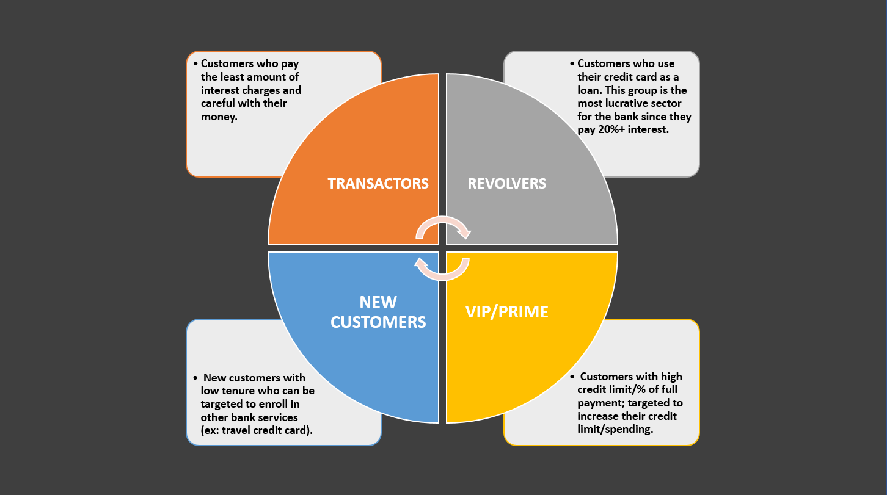

# Customer-Market-Segmentation-using-k-Means-Clustering

The objective of this project is to segregate customers into specific groups
so that the marketing team can target them with products and services
tailored to that specific groups.

For example: 

In this project we start by cleaning, transforming and performing EDA
on the dataset. We then find optimal number of clusters using Elbow method and train
our KMeans model based on optimal number of clusters. Lastly, we perform 
PCA to transform and gain insights from the data.

****
## About Dataset
The dataset summarizes the usage behavior of approximately 9000 active credit card holders in the last 6 months. 
It consists of 18 variables.

Dataset Link: https://www.kaggle.com/datasets/arjunbhasin2013/ccdata

### Data attribute
* `CUSTID`: Identification of Credit Card holder 
* `BALANCE`: Balance amount left in customer's account to make purchases
* `BALANCE_FREQUENCY`: How frequently the Balance is updated, score between 0 and 1 (1 = frequently updated, 0 = not frequently updated)
* `PURCHASES`: Amount of purchases made from account
* `ONEOFFPURCHASES`: Maximum purchase amount done in one-go
* `INSTALLMENTS_PURCHASES`: Amount of purchase done in installment
* `CASH_ADVANCE`: Cash in advance given by the user
* `PURCHASES_FREQUENCY`: How frequently the Purchases are being made, score between 0 and 1 (1 = frequently purchased, 0 = not frequently purchased)
* `ONEOFF_PURCHASES_FREQUENCY`: How frequently Purchases are happening in one-go (1 = frequently purchased, 0 = not frequently purchased)
* `PURCHASES_INSTALLMENTS_FREQUENCY`: How frequently purchases in installments are being done (1 = frequently done, 0 = not frequently done)
* `CASH_ADVANCE_FREQUENCY`: How frequently the cash in advance being paid
* `CASH_ADVANCE_TRX`: Number of Transactions made with "Cash in Advance"
* `PURCHASES_TRX`: Number of purchase transactions made
* `CREDIT_LIMIT`: Limit of Credit Card for user
* `PAYMENTS`: Amount of Payment done by user
* `MINIMUM_PAYMENTS`: Minimum amount of payments made by user  
* `PRC_FULL_PAYMENT`: Percent of full payment paid by user
* `TENURE`: Tenure of credit card service for user

****
# Libraries Used

## Data Analysis
`numpy`, `pandas`, `seaborn`, `matplotlib`, `warnings`

## K-Means and PCA

`StandardScaler`, `normalize`, `KMeans`, `PCA`